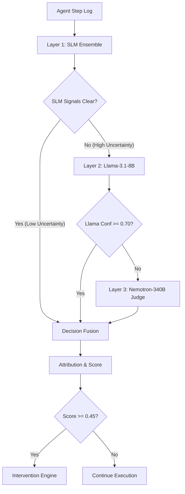

# Technical Specification — AgentTrace Hybrid Cascaded Pipeline

## 1. System Architecture
AgentTrace implements a 3-Layer Hybrid Cascade pipeline designed to intercept, classify, and mitigate step-level hallucinations in LLM agent workflows under a sub-300ms latency budget.

---

## 2. Component Specifications

### 2.1 Layer 1: SLM Ensemble (Context-Aware Detectors)
Layer 1 runs four highly optimized checkers in parallel using local CPU/GPU resources:
1.  **Semantic Consistency Checker (`SemanticChecker`):**
    *   **Model:** `sentence-transformers/all-MiniLM-L6-v2` (384-dimensional dense embeddings).
    *   **Metric:** Cosine similarity ($CS$) between step reasoning $R_t$ and tool action description $A_t$:
        $$CS(R_t, A_t) = \frac{\mathbf{v}_{R_t} \cdot \mathbf{v}_{A_t}}{\|\mathbf{v}_{R_t}\| \|\mathbf{v}_{A_t}\|}$$
    *   **Logic:** Raises a drift flag if $CS(R_t, A_t) < 0.75$.
2.  **Tool Claim Validator (`ToolValidator`):**
    *   **Logic:** Executes structural schema verification and parameter matching. Checks if tool output matches the inputs/expected outputs.
3.  **Factual Grounding Engine (`FactualGrounder`):**
    *   **Model:** `cross-encoder/nli-deberta-v3-small` (3-class NLI: Entailment, Neutral, Contradiction).
    *   **Logic:** Computes grounding alignment between step reasoning and external context:
        $$P(\text{contradiction}) > 0.4 \implies \text{flag as ungrounded}$$
4.  **Contradiction Detector (`ContradictionDetector`):**
    *   **Logic:** Runs a sliding NLI comparison matching step $s_t$ against all previous steps $s_{1 \dots t-1}$ to identify logical inconsistencies over time.

### 2.2 Layer 2: Llama-3.1-8B QLoRA Classifier
*   **Role:** Multi-class attribution and sequence classification.
*   **Prompt Formatting:** Combines the trajectory history, current tool output, and reasoning into a unified markdown prompt.
*   **Inference:** Outputs probability vectors $P(c | s_t)$ over the 6 error classes.
*   **Cascading Trigger:** Passes step to Layer 3 if classification confidence $\max_c P(c | s_t) < 0.70$.

### 2.3 Layer 3: Nemotron-340B Judge
*   **Role:** High-capacity validation and intervention resolution.
*   **Inference:** Invoked via OpenRouter API with a zero-shot chain-of-thought prompt structure detailing the system guidelines, step description, and grounding context.

---

## 3. Mathematical Formulations & Fusion

### 3.1 Temperature Scaling Calibration
To calibrate confidence scores returned by the SLM ensemble, we map raw scores to logit space, scale by temperature $T$, and map back via sigmoid:
$$\text{logit}(p) = \log\left(\frac{p}{1 - p}\right)$$
$$p_{\text{calibrated}} = \sigma\left(\frac{\text{logit}(p)}{T}\right) = \frac{1}{1 + e^{-\frac{\text{logit}(p)}{T}}}$$
Where $T$ is optimized by minimizing negative log-likelihood (NLL) loss on validation data (empirically $T \approx 1.5$).

### 3.2 Signal Fusion
The aggregate step score $S(s_t)$ is formulated as:
$$S(s_t) = w_{\text{SLM}} \cdot \bar{S}_{\text{SLM}} + w_{\text{Llama}} \cdot (1 - P(\text{No-Hallucination} | s_t))$$
*   Weights: $w_{\text{SLM}} = 0.4$, $w_{\text{Llama}} = 0.6$.
*   $\bar{S}_{\text{SLM}}$ is the mean score across the four SLM checkers.
*   A step is flagged as hallucinated if $S(s_t) \ge 0.45$.

---

## 4. SQLite Persistence Layout
Database file: `data/trajectories.db` (Gitignored).
Tables are auto-initialized on import:
*   `trajectories`:
    *   `trajectory_id` (TEXT, Primary Key)
    *   `task` (TEXT)
    *   `num_steps` (INTEGER)
    *   `num_hallucinated` (INTEGER)
    *   `overall_confidence` (REAL)
    *   `created_at` (TEXT)
    *   `response_json` (TEXT) - Serialized full FastAPI response
    *   `steps_raw_json` (TEXT) - Serialized input step list

---

## 5. Performance Optimizations (Shared Model Memory)
To eliminate duplicate weight loading, the FastAPI backend preloads the sentence-transformer tokenizer/embeddings and Deberta cross-encoder once in `DetectionPipeline.__init__` and injects them directly into the checker modules. This reduces memory footprint by 4x and drops backend startup initialization from 45s to $\approx 10\text{s}$.
